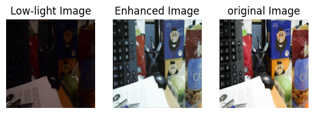

# 🌌 Low-Light Image Enhancement using U-Net

This project implements a **Low-Light Image Enhancement** model using a U-Net-based Convolutional Neural Network. It enhances visibility in underexposed images using paired datasets of low-light and normal-light images.

## 📌 Highlights

- ✅ Architecture: U-Net
- ✅ Input size: 256 × 256 × 3
- ✅ Dataset: Paired low-light and enhanced images
- ✅ Output: RGB enhanced image
- ✅ Format: Train/test using `low/` and `high/` folders

---

## 🧠 Model Architecture

The model is based on the U-Net architecture, which includes:

- **Encoder**: Convolutional layers + MaxPooling
- **Bottleneck**: Dense feature representation
- **Decoder**: Transposed Convolution + Skip Connections
- **Output Layer**: 3-channel sigmoid activation for RGB images

---
## 🖼️ Example Results

After running the `test_image.py` script, you will see a visual comparison of:

<p align="center">
  
</p>

- **Low-light Input**: Original low-light image from the dataset
- **Enhanced Output**: Output from the U-Net model
- **Original Image**: Reference high-light image for comparison

---
## 🔍 How to Run on a Test Image

- Upload the model (my_model) and your test and original images to your working directory (Colab or local).
- Run the following Python script:

```python
from tensorflow.keras.models import load_model
import matplotlib.pyplot as plt
import numpy as np
from PIL import Image

# Load and preprocess image
def load_image(image_path, size=(256, 256)):
    img = Image.open(image_path)
    img = img.resize(size)
    img = np.array(img).astype(np.float32) / 255.0
    return img

# Load the trained model
model = load_model(
    'my_model.keras',
    custom_objects={'combined_loss': combined_loss}
)

# Load test and original images
test_image = load_image('path to your test image')
org_img = load_image('path to your original image')

# Test the model
test_image_expanded = np.expand_dims(test_image, axis=0)
enhanced_image = model.predict(test_image_expanded)

# Plot results
plt.figure(figsize=(12, 4))
plt.subplot(1, 3, 1)
plt.title('Low-light Image')
plt.axis('off')
plt.imshow(test_image)

plt.subplot(1, 3, 2)
plt.title('Enhanced Image')
plt.axis('off')
plt.imshow(np.squeeze(enhanced_image))

plt.subplot(1, 3, 3)
plt.title('Original Image')
plt.axis('off')
plt.imshow(org_img)

plt.show()
```


